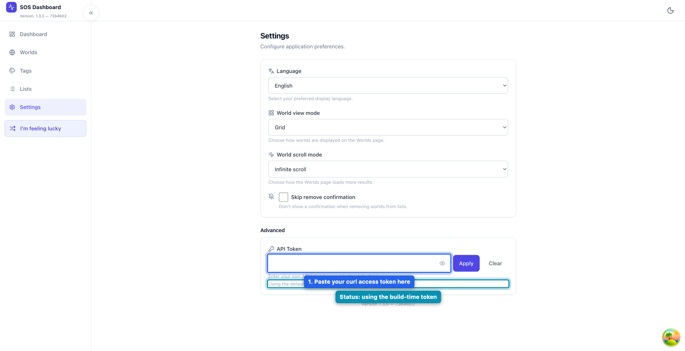
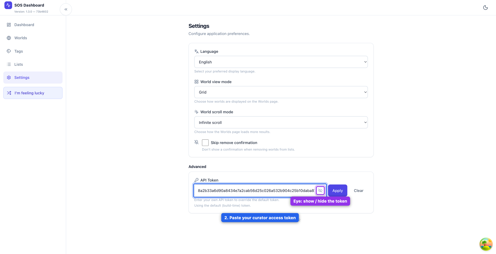
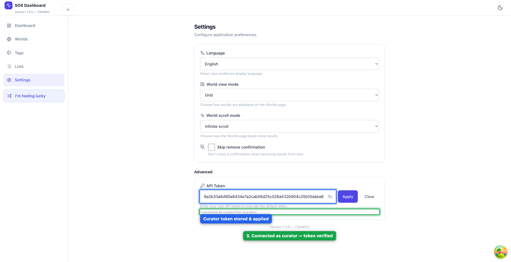
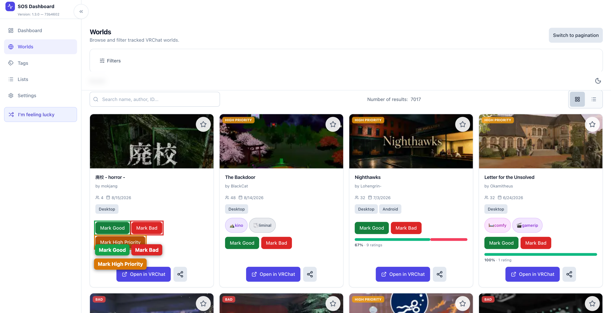
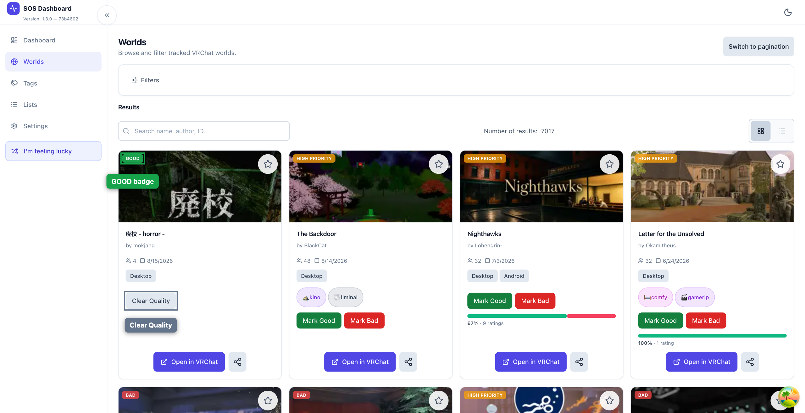
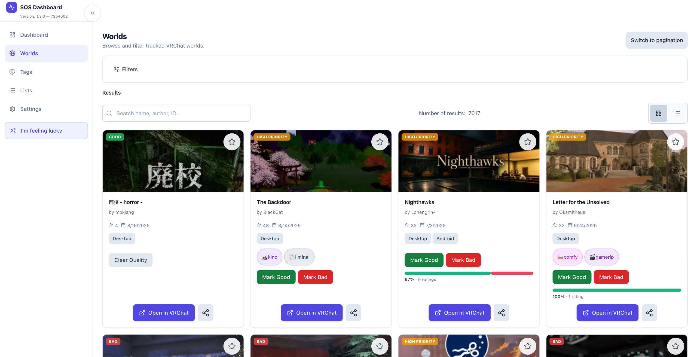
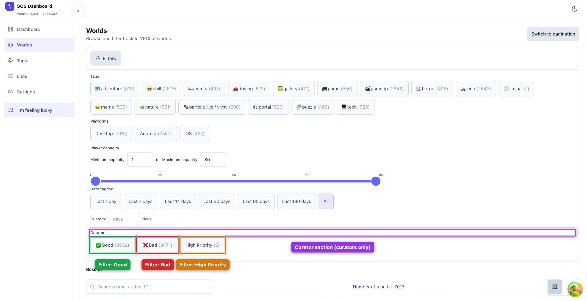

# Curator Guide: Access Tokens & Curation Quality Buttons

This guide walks through how to connect with a curator access token and then use the quality buttons on the Worlds page to mark a world as **Good**, **Bad**, or **High Priority** (and how to clear a rating afterwards).

All screenshots were captured against a locally run build (`pnpm dev`) pointed at the testnet API, using the sample curator token below.

> **Security note:** Keep your access token private. Anyone holding it can change curation state for the connected guild. The screenshots in this guide show the token only to illustrate the workflow — your real token should stay masked the rest of the time.

## Prerequisites

- The app running locally (`pnpm dev`, defaults to `http://localhost:5173`)
- A curator access token (issued by an admin). The examples below use:
  `8a2b33a6d90a8434e7a2cab56d25c026a532b904c25b10daba874992677b7fb2`

---

## Part 1 — Connecting a Curator Access Token

### 1. Open the Settings page

Click **Settings** in the left sidebar. Scroll down to the **Advanced** section and find the **API Token** input.

By default the field is empty and the app uses whatever token was baked in at build time, shown under the input as *"Using the default (build-time) token."*

### 2. Paste your access token

Paste the token into the **API Token** field. It is masked by default — use the eye icon (**Show token**) if you want to double-check what you pasted.

### 3. Apply the token

Click **Apply**. The app calls the backend's `/api/me` endpoint with your token to verify it and load your identity.

When valid, the status line under the input changes to **"Connected as `curatorTest` (curator)."** (the exact name/role depend on your account). If the token is wrong or expired, it will show **"Invalid token."** and curator features will stay hidden.

Click **Clear** at any time to drop the token and go back to the build-time default.

---

## Part 2 — Using the Curation Quality Buttons

The quality buttons live on every **world card** on the **Worlds** page. They only appear when you are connected with a token that has the `worlds:write` permission — i.e. a curator.

### 1. Open the Worlds page

Click **Worlds** in the sidebar. Each world card in the grid (or list) view shows up to three curator buttons at the bottom of the card:

- **Mark Good** (green)
- **Mark Bad** (red)
- **Mark High Priority** (amber)

An untagged world shows all three buttons:

### 2. Mark a world as Good

Click the green **Mark Good** button on a world. A **GOOD** badge appears in the top-left corner of the card thumbnail, and the three buttons are replaced by a single **Clear Quality** button. The rating persists on the server for everyone to see.

### 3. Mark a world as Bad

Click the red **Mark Bad** button on a world. A red **BAD** badge appears on the thumbnail, and the card switches to the **Clear Quality** control.

### 4. Mark a world as High Priority

Click the amber **Mark High Priority** button on an untagged world. An amber **HIGH PRIORITY** badge appears on the thumbnail. The high-priority option disappears from that card (it is already tagged), leaving only **Mark Good** / **Mark Bad** — you can promote a high-priority world to a quality rating at any time.

### 5. Clearing a rating

Both quality tags and high-priority flags combine into a single **Clear Quality** button once the world has any curation state. Click it to return the world to an untagged state and show all three buttons again.

---

## Bonus — Filtering by quality

Open the **Filters** panel while connected as a curator. A **Curator** section lists the current counts and lets you filter the grid:

- **✅ Good** — every world marked Good
- **❌ Bad** — every world marked Bad
- **High Priority** — every world flagged high priority

---

## Troubleshooting

- **"Invalid token."** on Settings — the token is malformed, expired, or not a curator token. Double-check it was copied in full, then click **Apply** again.
- **No curation buttons on world cards** — the connected token either was not entered (the status reads *"Using the default (build-time) token."*) or lacks the `worlds:write` permission.
- **Changes don't stick after reload** — the quality button calls the backend `PUT /api/worlds/:id/quality`. If the underlying API is unreachable, the optimistic UI rolls back and an error toast appears.